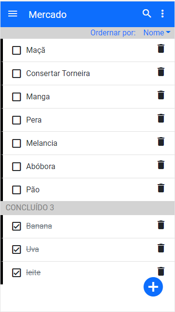
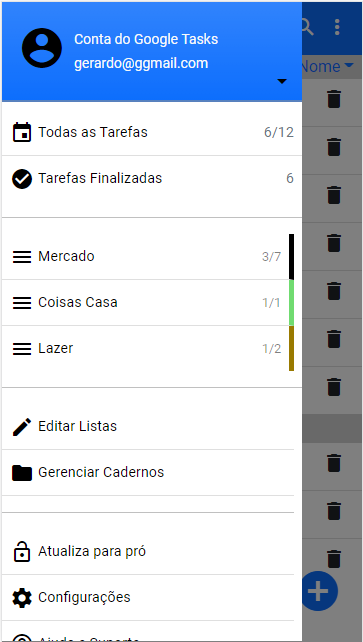
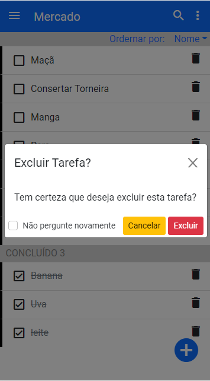
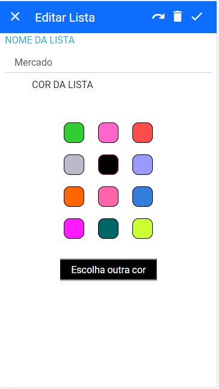
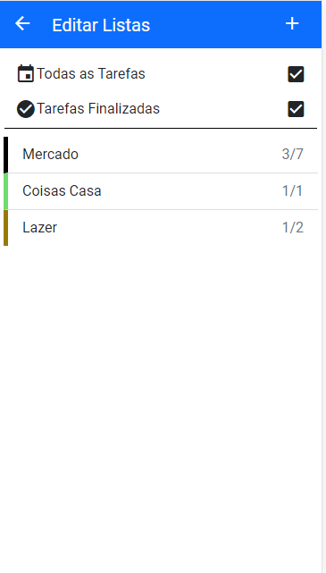
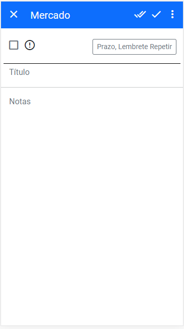
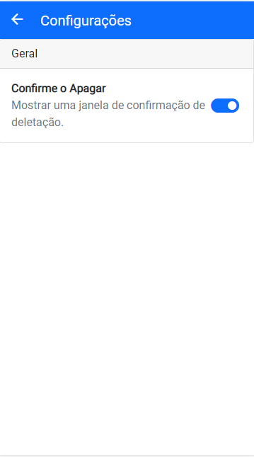

<h1> 
 Whendo Clone
  
</h1>

###### Feito com:

|   |   |
|---|---|
|  VueJs |  Bootstrap |


## Sobre o projeto
Trata-se de um simples desafio prático:  clonar a interface do app Whendo, utilizando apenas VueJs e Bootstrap. O projeto é apenas para fins didáticos, onde são utilizados alguns recursos do Vue, tais como Vue Router e Vuex. É possível adcionar cadernos, listas e tarefas, porém, como não é utilizada a API do Google Tasks, e nem um banco de dados, os dados registrados voltam ao padrão ao atualizar o navegador.

### Telas do Projeto

|   |   |   |
|---|---|---|
|   |   |   |
|   |   |   |

### Live Preview
- [Render](https://when-do-clone.onrender.com/#/)
- [Heroku](https://whendo.herokuapp.com/#/)

## Instalação

``` 
git clone https://github.com/betogroo/vue_when_do.git

cd vue_when_do

npm install
```

## Rodando a aplicação

```
npm run serve

```

### Nova versão
Uma nova versão está em desenvolvimento utilizando Vuetify e Material Design Icons, que trará mais fidelidade


### Nota
Este plicativo foi desenvolvido apenas para fins didáticos e de aprendizagem. Não é possível sua utilização em produção. Para utilizar o aplicativo oficial, o mesmo pode ser baixado em clicando [aqui](https://play.google.com/store/apps/details?id=com.vrproductiveapps.whendo&hl=en_US&gl=US)

